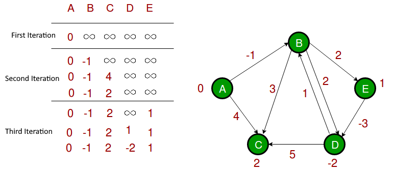

# Graph Traversal

In computer science, graph traversal (also known as graph search) refers to the process of visiting (checking and/or updating) each vertex in a graph.   
Such traversals are classified by the order in which the vertices are visited. Tree traversal is a special case of graph traversal.


### Graph traversal algorithms

#### Depth-First Search

A depth-first search (DFS) is an algorithm for traversing a finite graph. DFS visits the child vertices before visiting the sibling vertices; that is, it traverses the depth of any particular path before exploring its breadth. A stack is generally used when implementing the algorithm.

#### Breadth-First Search

A breadth-first search (BFS) is another technique for traversing a finite graph. BFS visits the sibling vertices before visiting the child vertices, and a queue is used in the search process. This algorithm is often used to find the **shortest path** from one vertex to another.

BFS is going to use more memory depending on the branching factor, however, BFS is a complete algorithm, meaning if you are using it to search for something in the lowest depth possible, BFS will give you the optimal solution. 

BFS space complexity is O(b^d) ->  the branching factor raised to the depth (can be A LOT of memory).  

DFS on the other hand, is much better about space however it may find a suboptimal solution. Meaning, if you are just searching for a path from one vertex to another, you may find the suboptimal solution (and stop there) before you find the real shortest path.   
DFS space complexity is O(|V|)-> meaning that the most memory it can take up is the longest possible path.

They have the same time complexity.  
In terms of implementation, **BFS is usually implemented with Queue, while DFS uses a Stack.**


### Finding Shortest Path

* Undirected graphs: Dijkstra's algorithm with list O(V^2) 
    Used when Source vertex is known Solved using MinHeap + Map
    A* achieves better performance by using heuristics to guide its search.
* Directed graphs with arbitrary weights without negative cycles:
  1. Bellman–Ford algorithm Time complexity O(VE)   
     Go thru all the edges of the graph, V-1 times and switch the map if distance[v] > distance[u] + weightEdge(u,v)
  2. Floyd–Warshall's Algorithm is used to find the shortest paths between between all pairs  
  shortestPath(i,j,k)= min( shortestPath(i,j,k-1), shortestPath(i,k,k-1)+shortestPath(k,j, k-1))


### Dijkstra's Algorithm

```

    for each vertex v in Graph.Vertices:            
          dist[v] ← INFINITY                 
          prev[v] ← UNDEFINED                
          add v to Q                     
    
    
    dist[source] ← 0                       
       
    while Q is not empty:
        u ← vertex in Q with min dist[u]   
        remove u from Q
                                        
        for each neighbor v of u still in Q:
            alt ← dist[u] + Graph.Edges(u, v)
            if alt < dist[v]:              
               dist[v] ← alt
               prev[v] ← u

    return dist[], prev[]

```
Say we want to find the Mininum Distance btetween points 0 to 4


We use a Set to Store Vertices already encountered, say computed = {}  
We use a map to store the minimum distance from origin (0), such that we hve the following map


| Vertex | Distance |
|---|---|
| 0 | inf |
| 1 | inf |
| 2 | inf |
| 3 | inf |
| 4 | inf |
| 5 | inf |
| 6 | inf |
| 7 | inf |
| 8 | inf |

Now the first point is 0, which has a distance 0 to 0, and adjacent vertices 1 and 7, so we have 

| | |
|---|---|
||<table><th>Vertex</th><th>Distance</th><tr><td>0</td><td>0</td></tr><tr><td>1</td><td>INF</td></tr><tr><td>2</td><td>INF</td></tr><tr><td>3</td><td>INF</td></tr><tr><td>4</td><td>INF</td></tr><tr><td>5</td><td>INF</td></tr><tr><td>6</td><td>INF</td></tr><tr><td>7</td><td>INF</td></tr><tr><td>8</td><td>INF</td></tr></table>|
|computed = {0}| available = {1, 7} |

Now, from available, we find vertices not in set, which are 1 and 7 and minimum distance is 4 (for 1), so we update its distance in the set and update the values as

| | |
|---|---|
||<table><th>Vertex</th><th>Distance</th><tr><td>0</td><td>0</td></tr><tr><td>1</td><td>4</td></tr><tr><td>2</td><td>INF</td></tr><tr><td>3</td><td>INF</td></tr><tr><td>4</td><td>INF</td></tr><tr><td>5</td><td>INF</td></tr><tr><td>6</td><td>INF</td></tr><tr><td>7</td><td>INF</td></tr><tr><td>8</td><td>INF</td></tr></table>|
|computed = {0, 1}| available = {7, 2} |

Now distance from 0->2 is 0->1(4) + (1->2)(8) = 12, which is less than 0->7 (8), so we have

| | |
|---|---|
||<table><th>Vertex</th><th>Distance</th><tr><td>0</td><td>0</td></tr><tr><td>1</td><td>4</td></tr><tr><td>2</td><td>INF</td></tr><tr><td>3</td><td>INF</td></tr><tr><td>4</td><td>INF</td></tr><tr><td>5</td><td>INF</td></tr><tr><td>6</td><td>INF</td></tr><tr><td>7</td><td>8</td></tr><tr><td>8</td><td>INF</td></tr></table>|
|computed = {0, 1, 7}| available = {2, 8, 6} |

Continuing on,


| | |
|---|---|
||<table><th>Vertex</th><th>Distance</th><tr><td>0</td><td>0</td></tr><tr><td>1</td><td>4</td></tr><tr><td>2</td><td>INF</td></tr><tr><td>3</td><td>INF</td></tr><tr><td>4</td><td>INF</td></tr><tr><td>5</td><td>INF</td></tr><tr><td>6</td><td>9</td></tr><tr><td>7</td><td>8</td></tr><tr><td>8</td><td>INF</td></tr></table>|
|computed = {0, 1, 7}| available = {2, 8, 6} |


and so on, we get the final minimum distances from point 0 to all points as   


### Bellman Ford Algorithm

Dijksra’s algorithm is a Greedy algorithm and time complexity is O(VLogV) (with the use of Fibonacci heap).   
Dijkstra doesn’t work for Graphs with negative weight edges, Bellman-Ford works for such graphs.  
Bellman-Ford is also simpler than Dijkstra and suites well for distributed systems. But time complexity of Bellman-Ford is O(VE), which is more than Dijkstra.


```
    // Step 1: initialize graph
    for each vertex v in vertices do
        distance[v] := inf             // Initialize the distance to all vertices to infinity
        predecessor[v] := null         // And having a null predecessor
    
    
    distance[source] := 0              // The distance from the source to itself is, of course, zero


    // Step 2: relax edges repeatedly 
    repeat |V|−1 times:
         for each edge (u, v) with weight w in edges do
             if distance[u] + w < distance[v] then
                 distance[v] := distance[u] + w
                 predecessor[v] := u

```




### Floyd–Warshall algorithm

Floyd–Warshall algorithm is an algorithm for finding all shortest paths in a directed weighted graph with positive or negative edge weights

```
let dist be a |V| × |V| array of minimum distances initialized to ∞ (infinity)
for each edge (u, v) do
    dist[u][v] ← w(u, v)  // The weight of the edge (u, v)
for each vertex v do
    dist[v][v] ← 0
for k from 1 to |V|
    for i from 1 to |V|
        for j from 1 to |V|
            if dist[i][j] > dist[i][k] + dist[k][j] 
                dist[i][j] ← dist[i][k] + dist[k][j]
            end if
```


The distance matrix at each iteration of k, with the updated distances in bold, will be:

<table class="wikitable" style="float:left; margin:10px; text-align:center;">
<caption>
</caption>
<tbody><tr>
<td colspan="2" rowspan="2"><span class="texhtml"><i>k</i> = 0</span>
</td>
<td colspan="4"><span class="texhtml mvar" style="font-style:italic;">j</span>
</td></tr>
<tr>
<th>1</th>
<th>2</th>
<th>3</th>
<th>4
</th></tr>
<tr>
<td rowspan="4"><span class="texhtml mvar" style="font-style:italic;">i</span>
</td>
<th>1
</th>
<td>0</td>
<td>&#8734;</td>
<td>−2</td>
<td>&#8734;
</td></tr>
<tr>
<th>2
</th>
<td>4</td>
<td>0</td>
<td>3</td>
<td>&#8734;
</td></tr>
<tr>
<th>3
</th>
<td>&#8734;</td>
<td>&#8734;</td>
<td>0</td>
<td>2
</td></tr>
<tr>
<th>4
</th>
<td>&#8734;</td>
<td>−1</td>
<td>&#8734;</td>
<td>0
</td></tr></tbody></table>
<table class="wikitable" style="float:left; margin:10px; text-align:center;">
<caption>
</caption>
<tbody><tr>
<td colspan="2" rowspan="2"><span class="texhtml"><i>k</i> = 1</span>
</td>
<td colspan="4"><span class="texhtml mvar" style="font-style:italic;">j</span>
</td></tr>
<tr>
<th>1</th>
<th>2</th>
<th>3</th>
<th>4
</th></tr>
<tr>
<td rowspan="4"><span class="texhtml mvar" style="font-style:italic;">i</span>
</td>
<th>1
</th>
<td>0</td>
<td>&#8734;</td>
<td>−2</td>
<td>&#8734;
</td></tr>
<tr>
<th>2
</th>
<td>4</td>
<td>0</td>
<td><b>2</b></td>
<td>&#8734;
</td></tr>
<tr>
<th>3
</th>
<td>&#8734;</td>
<td>&#8734;</td>
<td>0</td>
<td>2
</td></tr>
<tr>
<th>4
</th>
<td>&#8734;</td>
<td>−1</td>
<td>&#8734;</td>
<td>0
</td></tr></tbody></table>
<table class="wikitable" style="float:left; margin:10px; text-align:center;">
<caption>
</caption>
<tbody><tr>
<td colspan="2" rowspan="2"><span class="texhtml"><i>k</i> = 2</span>
</td>
<td colspan="4"><span class="texhtml mvar" style="font-style:italic;">j</span>
</td></tr>
<tr>
<th>1</th>
<th>2</th>
<th>3</th>
<th>4
</th></tr>
<tr>
<td rowspan="4"><span class="texhtml mvar" style="font-style:italic;">i</span>
</td>
<th>1
</th>
<td>0</td>
<td>&#8734;</td>
<td>−2</td>
<td>&#8734;
</td></tr>
<tr>
<th>2
</th>
<td>4</td>
<td>0</td>
<td>2</td>
<td>&#8734;
</td></tr>
<tr>
<th>3
</th>
<td>&#8734;</td>
<td>&#8734;</td>
<td>0</td>
<td>2
</td></tr>
<tr>
<th>4
</th>
<td><b>3</b></td>
<td>−1</td>
<td><b>1</b></td>
<td>0
</td></tr></tbody></table>
<table class="wikitable" style="float:left; margin:10px; text-align:center;">
<caption>
</caption>
<tbody><tr>
<td colspan="2" rowspan="2"><span class="texhtml"><i>k</i> = 3</span>
</td>
<td colspan="4"><span class="texhtml mvar" style="font-style:italic;">j</span>
</td></tr>
<tr>
<th>1</th>
<th>2</th>
<th>3</th>
<th>4
</th></tr>
<tr>
<td rowspan="4"><span class="texhtml mvar" style="font-style:italic;">i</span>
</td>
<th>1
</th>
<td>0</td>
<td>&#8734;</td>
<td>−2</td>
<td><b>0</b>
</td></tr>
<tr>
<th>2
</th>
<td>4</td>
<td>0</td>
<td>2</td>
<td><b>4</b>
</td></tr>
<tr>
<th>3
</th>
<td>&#8734;</td>
<td>&#8734;</td>
<td>0</td>
<td>2
</td></tr>
<tr>
<th>4
</th>
<td>3</td>
<td>−1</td>
<td>1</td>
<td>0
</td></tr></tbody></table>
<table class="wikitable" style="float:left; margin:10px; text-align:center;">
<caption>
</caption>
<tbody><tr>
<td colspan="2" rowspan="2"><span class="texhtml"><i>k</i> = 4</span>
</td>
<td colspan="4"><span class="texhtml mvar" style="font-style:italic;">j</span>
</td></tr>
<tr>
<th>1</th>
<th>2</th>
<th>3</th>
<th>4
</th></tr>
<tr>
<td rowspan="4"><span class="texhtml mvar" style="font-style:italic;">i</span>
</td>
<th>1
</th>
<td>0</td>
<td><b>−1</b></td>
<td>−2</td>
<td>0
</td></tr>
<tr>
<th>2
</th>
<td>4</td>
<td>0</td>
<td>2</td>
<td>4
</td></tr>
<tr>
<th>3
</th>
<td><b>5</b></td>
<td><b>1</b></td>
<td>0</td>
<td>2
</td></tr>
<tr>
<th>4
</th>
<td>3</td>
<td>−1</td>
<td>1</td>
<td>0
</td></tr></tbody></table>