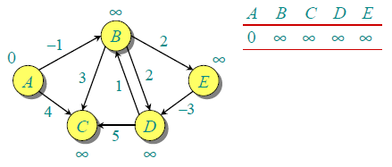

# Graph Traversal

In computer science, graph traversal (also known as graph search) refers to the process of visiting (checking and/or updating) each vertex in a graph.   
Such traversals are classified by the order in which the vertices are visited. Tree traversal is a special case of graph traversal.


### Graph traversal algorithms

#### Depth-First Search

A depth-first search (DFS) is an algorithm for traversing a finite graph. DFS visits the child vertices before visiting the sibling vertices; that is, it traverses the depth of any particular path before exploring its breadth. A stack is generally used when implementing the algorithm.

#### Breadth-First Search

A breadth-first search (BFS) is another technique for traversing a finite graph. BFS visits the sibling vertices before visiting the child vertices, and a queue is used in the search process. This algorithm is often used to find the **shortest path** from one vertex to another.

BFS is going to use more memory depending on the branching factor, however, BFS is a complete algorithm, meaning if you are using it to search for something in the lowest depth possible, BFS will give you the optimal solution. 

BFS space complexity is O(b^d) ->  the branching factor raised to the depth (can be A LOT of memory).  

DFS on the other hand, is much better about space however it may find a suboptimal solution. Meaning, if you are just searching for a path from one vertex to another, you may find the suboptimal solution (and stop there) before you find the real shortest path.   
DFS space complexity is O(|V|)-> meaning that the most memory it can take up is the longest possible path.

They have the same time complexity.  
In terms of implementation, **BFS is usually implemented with Queue, while DFS uses a Stack.**


### Finding Shortest Path

* Undirected graphs: Dijkstra's algorithm with list O(V^2) 
    Used when Source vertex is known Solved using MinHeap + Map
    A* achieves better performance by using heuristics to guide its search.
* Directed graphs with arbitrary weights without negative cycles:
  1. Bellman–Ford algorithm Time complexity O(VE)   
     Go thru all the edges of the graph, V-1 times and switch the map if distance[v] > distance[u] + weightEdge(u,v)
  2. Floyd–Warshall's Algorithm is used to find the shortest paths between between all pairs  
  shortestPath(i,j,k)= min( shortestPath(i,j,k-1), shortestPath(i,k,k-1)+shortestPath(k,j, k-1))


### Dijkstra's Algorithm

```

    for each vertex v in Graph.Vertices:            
          dist[v] ← INFINITY                 
          prev[v] ← UNDEFINED                
          add v to Q                     
    
    
    dist[source] ← 0                       
       
    while Q is not empty:
        u ← vertex in Q with min dist[u]   
        remove u from Q
                                        
        for each neighbor v of u still in Q:
            alt ← dist[u] + Graph.Edges(u, v)
            if alt < dist[v]:              
               dist[v] ← alt
               prev[v] ← u

    return dist[], prev[]

```
Say we want to find the Mininum Distance btetween points 0 to 4


Dijkstra's algorithm adds nodes to the queue in the same order as Breadth-First-Search (BFS) does: when a node is tested its immediate neighbors are added to the queue.
The difference is the way nodes are pulled out from the queue. While BFS does it in FIFO (first in first out) sequence, Dijkstra's algorithm does it by priority.
The node with the highest priority is pulled out from the queue. The priority is set by the cost to get from the origin to that node.
When the origin A is tested its immediate neighbors are added to the queue, so the queue holds 2 nodes :

```
B(10), C(3)
```

For convenience I added the cost to each node's name.
The next node to be pulled out of the queue and tested, is the one with the highest priority = lowest cost which is C. After testing C the queue looks like that:

```
B(7), E(5), D(11)
```

**The cost of B was updated from 10 to 7 because a path with a lower cost (A->C->B) was found.**  
The next node to be pulled out of the queue is E. Testing E does not add add any of its neighbors (C,D) to the queue. C has already been tested , and D is in the queue.
The queue after pulling E out looks like that:

B(7), D(11)

B which has the highest priority (lowest cost from origin) is pulled out from the queue.  
**Testing B updates the cost of D to 7+2 = 9.**   
Now we have only D in the queue:

D(9)

D is pulled out and because it it the target the search stops. The right shortest path having the cost of 9 has been found.


### Bellman Ford Algorithm

Dijksra’s algorithm is a Greedy algorithm and time complexity is O(VLogV) (with the use of Fibonacci heap).   
Dijkstra doesn’t work for Graphs with negative weight edges, Bellman-Ford works for such graphs.  
Bellman-Ford is also simpler than Dijkstra and suites well for distributed systems. But time complexity of Bellman-Ford is O(VE), which is more than Dijkstra.


```
    // Step 1: initialize graph
    for each vertex v in vertices do
        distance[v] := inf             // Initialize the distance to all vertices to infinity
        predecessor[v] := null         // And having a null predecessor
    
    
    distance[source] := 0              // The distance from the source to itself is, of course, zero


    // Step 2: relax edges repeatedly 
    repeat |V|−1 times:
         for each edge (u, v) with weight w in edges do
             if distance[u] + w < distance[v] then
                 distance[v] := distance[u] + w
                 predecessor[v] := u

```

|   |   |
|---|---|
| | Let the given source vertex be 0. Initialize all distances as infinite, except the distance to source itself. Total number of vertices in the graph is 5, so all edges must be processed 4 times.|
| | Let all edges are processed in following order: (B,E), (D,B), (B,D), (A,B), (A,C), (D,C), (B,C), (E,D). <br> We get following distances when all edges are processed first time. <br> The first row in shows initial distances. <br> The second row shows distances when edges (B,E), (D,B), (B,D) and (A,B) are processed. <br> The third row shows distances when (A,C) is processed. <br> The fourth row shows when (D,C), (B,C) and (E,D) are processed. |
| | The second iteration guarantees to give all shortest paths which are at most 2 edges long. The algorithm processes all edges 2 more times. The distances are minimized after the second iteration, so third and fourth iterations don’t update the distances. |


### Floyd–Warshall algorithm

Floyd–Warshall algorithm is an algorithm for finding all shortest paths in a directed weighted graph with positive or negative edge weights

```
let dist be a |V| × |V| array of minimum distances initialized to ∞ (infinity)
for each edge (u, v) do
    dist[u][v] ← w(u, v)  // The weight of the edge (u, v)
for each vertex v do
    dist[v][v] ← 0
for k from 1 to |V|
    for i from 1 to |V|
        for j from 1 to |V|
            if dist[i][j] > dist[i][k] + dist[k][j] 
                dist[i][j] ← dist[i][k] + dist[k][j]
            end if
```


The distance matrix at each iteration of k, with the updated distances in bold, will be:

<table class="wikitable" style="float:left; margin:10px; text-align:center;">
<caption>
</caption>
<tbody><tr>
<td colspan="2" rowspan="2"><span class="texhtml"><i>k</i> = 0</span>
</td>
<td colspan="4"><span class="texhtml mvar" style="font-style:italic;">j</span>
</td></tr>
<tr>
<th>1</th>
<th>2</th>
<th>3</th>
<th>4
</th></tr>
<tr>
<td rowspan="4"><span class="texhtml mvar" style="font-style:italic;">i</span>
</td>
<th>1
</th>
<td>0</td>
<td>&#8734;</td>
<td>−2</td>
<td>&#8734;
</td></tr>
<tr>
<th>2
</th>
<td>4</td>
<td>0</td>
<td>3</td>
<td>&#8734;
</td></tr>
<tr>
<th>3
</th>
<td>&#8734;</td>
<td>&#8734;</td>
<td>0</td>
<td>2
</td></tr>
<tr>
<th>4
</th>
<td>&#8734;</td>
<td>−1</td>
<td>&#8734;</td>
<td>0
</td></tr></tbody></table>
<table class="wikitable" style="float:left; margin:10px; text-align:center;">
<caption>
</caption>
<tbody><tr>
<td colspan="2" rowspan="2"><span class="texhtml"><i>k</i> = 1</span>
</td>
<td colspan="4"><span class="texhtml mvar" style="font-style:italic;">j</span>
</td></tr>
<tr>
<th>1</th>
<th>2</th>
<th>3</th>
<th>4
</th></tr>
<tr>
<td rowspan="4"><span class="texhtml mvar" style="font-style:italic;">i</span>
</td>
<th>1
</th>
<td>0</td>
<td>&#8734;</td>
<td>−2</td>
<td>&#8734;
</td></tr>
<tr>
<th>2
</th>
<td>4</td>
<td>0</td>
<td><b>2</b></td>
<td>&#8734;
</td></tr>
<tr>
<th>3
</th>
<td>&#8734;</td>
<td>&#8734;</td>
<td>0</td>
<td>2
</td></tr>
<tr>
<th>4
</th>
<td>&#8734;</td>
<td>−1</td>
<td>&#8734;</td>
<td>0
</td></tr></tbody></table>
<table class="wikitable" style="float:left; margin:10px; text-align:center;">
<caption>
</caption>
<tbody><tr>
<td colspan="2" rowspan="2"><span class="texhtml"><i>k</i> = 2</span>
</td>
<td colspan="4"><span class="texhtml mvar" style="font-style:italic;">j</span>
</td></tr>
<tr>
<th>1</th>
<th>2</th>
<th>3</th>
<th>4
</th></tr>
<tr>
<td rowspan="4"><span class="texhtml mvar" style="font-style:italic;">i</span>
</td>
<th>1
</th>
<td>0</td>
<td>&#8734;</td>
<td>−2</td>
<td>&#8734;
</td></tr>
<tr>
<th>2
</th>
<td>4</td>
<td>0</td>
<td>2</td>
<td>&#8734;
</td></tr>
<tr>
<th>3
</th>
<td>&#8734;</td>
<td>&#8734;</td>
<td>0</td>
<td>2
</td></tr>
<tr>
<th>4
</th>
<td><b>3</b></td>
<td>−1</td>
<td><b>1</b></td>
<td>0
</td></tr></tbody></table>
<table class="wikitable" style="float:left; margin:10px; text-align:center;">
<caption>
</caption>
<tbody><tr>
<td colspan="2" rowspan="2"><span class="texhtml"><i>k</i> = 3</span>
</td>
<td colspan="4"><span class="texhtml mvar" style="font-style:italic;">j</span>
</td></tr>
<tr>
<th>1</th>
<th>2</th>
<th>3</th>
<th>4
</th></tr>
<tr>
<td rowspan="4"><span class="texhtml mvar" style="font-style:italic;">i</span>
</td>
<th>1
</th>
<td>0</td>
<td>&#8734;</td>
<td>−2</td>
<td><b>0</b>
</td></tr>
<tr>
<th>2
</th>
<td>4</td>
<td>0</td>
<td>2</td>
<td><b>4</b>
</td></tr>
<tr>
<th>3
</th>
<td>&#8734;</td>
<td>&#8734;</td>
<td>0</td>
<td>2
</td></tr>
<tr>
<th>4
</th>
<td>3</td>
<td>−1</td>
<td>1</td>
<td>0
</td></tr></tbody></table>
<table class="wikitable" style="float:left; margin:10px; text-align:center;">
<caption>
</caption>
<tbody><tr>
<td colspan="2" rowspan="2"><span class="texhtml"><i>k</i> = 4</span>
</td>
<td colspan="4"><span class="texhtml mvar" style="font-style:italic;">j</span>
</td></tr>
<tr>
<th>1</th>
<th>2</th>
<th>3</th>
<th>4
</th></tr>
<tr>
<td rowspan="4"><span class="texhtml mvar" style="font-style:italic;">i</span>
</td>
<th>1
</th>
<td>0</td>
<td><b>−1</b></td>
<td>−2</td>
<td>0
</td></tr>
<tr>
<th>2
</th>
<td>4</td>
<td>0</td>
<td>2</td>
<td>4
</td></tr>
<tr>
<th>3
</th>
<td><b>5</b></td>
<td><b>1</b></td>
<td>0</td>
<td>2
</td></tr>
<tr>
<th>4
</th>
<td>3</td>
<td>−1</td>
<td>1</td>
<td>0
</td></tr></tbody></table>